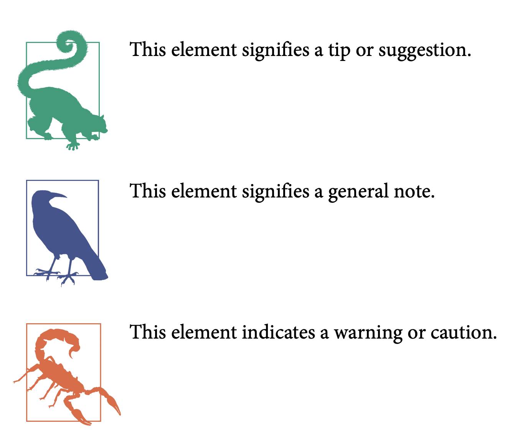
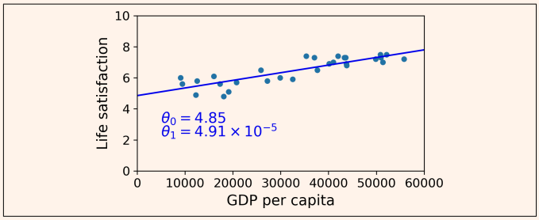

# Hands-On Machine Learning with Scikit-Learn and TensorFlow

- Scikit-Learn is very easy to use, yet it implements many Machine Learning algo‐
rithms efficiently, so it makes for a great entry point to learn Machine Learning.
- TensorFlow is a more complex library for distributed numerical computation. It
makes it possible to train and run very large neural networks efficiently by dis‐
tributing the computations across potentially hundreds of multi-GPU servers.
TensorFlow was created at Google and supports many of their large-scale
Machine Learning applications. It was open sourced in November 2015.
- Keras is a high level Deep Learning API that makes it very simple to train and
run neural networks. It can run on top of either TensorFlow, Theano or Micro‐
soft Cognitive Toolkit (formerly known as CNTK). TensorFlow comes with its
own implementation of this API, called tf.keras, which provides support for some
advanced TensorFlow features (e.g., to efficiently load data).

Buen repo para jugar con diferentes ejemplos: https://github.com/ageron/handson-ml2

Top course: 

[Supervised Machine Learning: Regression and Classification](https://www.coursera.org/learn/machine-learning)

- Good resources to read.
    - Joel Grus, Data Science from Scratch (O’Reilly). This book presents the funda‐
    mentals of Machine Learning, and implements some of the main algorithms in
    pure Python (from scratch, as the name suggests).
    - Stephen Marsland, Machine Learning: An Algorithmic Perspective (Chapman and
    Hall). This book is a great introduction to Machine Learning, covering a wide
    range of topics in depth, with code examples in Python (also from scratch, but
    using NumPy).
    - Sebastian Raschka, Python Machine Learning (Packt Publishing). Also a great
    introduction to Machine Learning, this book leverages Python open source libra‐
    ries (Pylearn 2 and Theano).
    - François Chollet, Deep Learning with Python (Manning). A very practical book
    that covers a large range of topics in a clear and concise way, as you might expect
    from the author of the excellent Keras library. It favors code examples over math‐
    ematical theory.
    - Yaser S. Abu-Mostafa, Malik Magdon-Ismail, and Hsuan-Tien Lin, Learning from
    Data (AMLBook). A rather theoretical approach to ML, this book provides deep
    insights, in particular on the bias/variance tradeoff (see Chapter 4).
    - Stuart Russell and Peter Norvig, Artificial Intelligence: A Modern Approach, 3rd
    Edition (Pearson). This is a great (and huge) book covering an incredible amount
    of topics, including Machine Learning. It helps put ML into perspective
- Notación
    
    
    
- Why use machine learning
    
    Do complex tasks for example detect spam in mail, voice recognition, etc.
    
    Discover patterns in large amounts of data is called data mining.
    
    
    
    To summarize, Machine Learning is great for:
    
    - Problems for which existing solutions require a lot of hand-tuning or long lists of rules: one Machine Learning algorithm can often simplify code and perform bet‐ ter.
    - Complex problems for which there is no good solution at all using a traditional approach: the best Machine Learning techniques can find a solution.
    - Fluctuating environments: a Machine Learning system can adapt to new data.
    - Getting insights about complex problems and large amounts of data
- Types of Machine Learning Systems
    - Categories**:**
        - Human supervision:
            - Supervised, unsupervised, semisupervised, reinforcement learning.
        - Can learn incrementally on fly
            - Online
            - Batch learning
        - Comparing new data points to known data points / detect patterns in training data and build predictive model
            - Like scientists do instance-based vs model-based learning
    - Supervised learning
        
        You feed the algorithm with labeled data.
        
        
        
        Example spam filter.
        
        Predict target numeric value ex, price of a car given a set of features (mileage, age, brand, etc.) called predictors. This is called regression. In this case you need to give it a lot of examples.
        
        
        
        <aside>
        📌 Some regression algorithms can be used for classification and vice versa.
        Logistic Regression is commonly used for classification.
        
        </aside>
        
    - Most important supervised learning
        - k-Nearest-Neighbors
        - Linear regression
        - Logistic Regression
        - Support Vector machines
        - Decision tress and random forests
        - Neural networks
            - Some neural network architectures can be unsupervised, such as autoencoders and restricted Boltzmann machines. They can also be semisupervised, such as in deep belief networks and unsupervised pretraining.
    - Unsupervised learning
        
        Data without labels, algorithm trie to learn.
        
        Split data into different clusters
        
        
        
        - Task Dimensionality reduction
            
            It tries to simplify data without loosing information.
            
            Merge correlated features into one, for example, a car’s mileage may be very correlated with its age, so the dimensionality reduction algorithm will merge them into one feature that represents the car’s wear and tear. This is called feature extraction
            
        - Anomaly Detection
            
            Detect unusual transactions to prevent fraud, manufacturing defects, remove outliers from dataset.
            
        - Association rule learning (Super→ chela,maní)
            
            Finally, another common unsupervised task is association rule learning, in which the goal is to dig into large amounts of data and discover interesting relations between
            attributes. For example, suppose you own a supermarket. Running an association rule on your sales logs may reveal that people who purchase barbecue sauce and potato chips also tend to buy steak. Thus, you may want to place these items close to each other.
            
    - Most important unsupervised learning algorithms
        - Clustering
            - K-Means
            - DBSCAN
            - Hierarchical Cluster Analysis (HCA)
        - Anomaly detection and novelty detection
            - One-class SVM
            - Isolation Forest
        - Visualiztion and dimensionality reduction (VADR)
            - Principal Component Analysis (PCA)
            - Kernel PCA
            - Locally-Linear Embedding (LLE)
            - t-distributed Stochastic Neighbor Embedding (t-SNE)
        - Association rule learning
            - Apriori
            - Eclat
    - Semisupervised learning
        
         A lot of unlabeled data and little bit of labeled.
        
        Google photos, you label someone and then the algorithm learn.
        
        Most are combinations of unsupervised and supervised algos.
        
    - Reinforcement Learning
        
        Observe the environment take an action and get rewards or penalties.
        
        
        
        AlhpaGo is an example.
        
        It learned from N games and then playing again itself, then he learned a policy and apply to win the workld champion.
        
    - Batch and online Learning
        
        The power of learn incrementally from a stream of incoming data.
        
        - Batch learning (Incapable of learning incrementally)
            
            Train with known data → get the model. 
            
            You must train again and re deploy to get newer data.
            
        - sOnline learning
            
            
            
            One example of this is stock prices.
            
            <aside>
            📌 To train huge datasets you can do out-of-core learning.
            The algorithm loads part of the data, runs a training step on that data and then repeats the process until it has run on all of the data.
            
            </aside>
            
            
            
            <aside>
            🧩 Learning rate: How fast a model should adapt to chaning data
            
            Higher rate, system rapidly adapt to new data but tend to quickly forget old data…
            
            Set lower, will learn slowly but will be less sensitive to noise or outliers.
            
            </aside>
            
            <aside>
            🔥 GIGO, one big challenge is if the data that is fed to the system is bad, the performance will gradually decline.
            
            You must set a monitor and turn off learning if you detect a drop in performance. And also you need monitor to detect outliers (you can use an anomaly detection algorithm).
            
            </aside>
            
    - Instance-based vs Model-Based learning
        
        To categorize ML you nedd to know how they generalize.
        
        They make predictions, given N number of training examples how they are able to generalize examples that has never seen before.
        
        - Instance-based learning (Similarity measure)
            
            To attack spam issue, your system can learn to flag mails identically to emails that have already been flaged by users (labeled data). 
            
            Then you can improve this by having a *measure of similarity between two emails,* e.g. number of words count.
            
            Instance-based learning learns the examples by hearth, using an SM (Similarity measure).
            
        - Model-based learning
            
            To generalize a set of examples is to build a model of these examples, then use that model to make predictions.
            
            
            
            > **Does money make people happier?**
            > 
            
            
            
            It seems to be a trend here. Although the data is noisy (i.e., partly random), it looks like life satisfaction goes up more or less linearly as the country’s GDP per capita increases
            
            We decide to model life satisfaction as a linear function of GDP per capita.
            
            This is called model selection, linear model with just one attribute GDP per capita.
            
            Equation 1-1. A simple linear model.
            
            
            
            
            
            Now you must define theta 0 and 1 values, which values will make your model perform the best?
            
            **Specify a performance measure.**
            
            - Utility function or fitness function
                - how good your model is.
            - Cost function → Tipically used in linear regression problems.
                - How bad your model is.
            
            You feed it your training examples and finds the parameters that make the linear model fit best to your data. → *This is called training the model.* Optimal parameteers values are: θ0 = 4.85 and θ1 = 4.91 × 10–5

            

            
    - .
# Main challenges of Machine Learning

Bad algorithm
Bad data

## Insufficient Quantity of Training Data

[]
